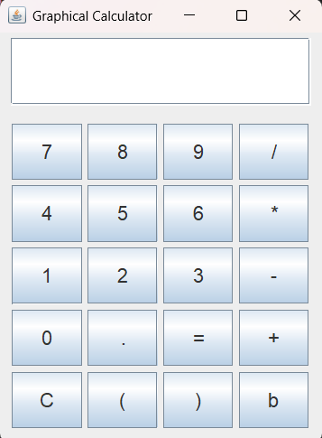
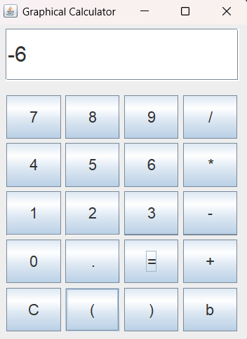
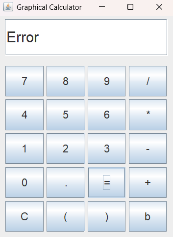

# Java Swing Graphical Calculator

This project implements a simple graphical calculator using Java Swing. Each part is component-based and placed in its own file. Mathematical expressions are evaluated via a helper class using JavaScript's `eval`.

---

## 📋 Table of Contents

1. [Features](#features)
2. [Prerequisites](#prerequisites)
3. [Project Structure](#project-structure)
4. [How to Run](#how-to-run)
5. [Component Details](#component-details)

---

## Features

* Graphical UI built with Java Swing.
* Modular component design: each class in a separate file.
* Supports addition (`+`), subtraction (`-`), multiplication (`*`), and division (`/`).
* Clear button to reset the display.
* Displays "Error" for invalid expressions.

---

## Prerequisites

* Java Development Kit (JDK) 8 or higher installed.

---

## Project Structure

```
app/
 ├─ CalculatorApp.java    # Main class to launch the app
 ├─ DisplayPanel.java     # Panel for input/output display
 ├─ ButtonPanel.java      # Panel containing calculator buttons
 └─ EvalUtil.java         # Utility class for expression evaluation

Launcher.java

```

---

## How to Run

1. Open a terminal.
2. Change the directory where the Launcher.java is.
3. Run this command:
```bash
java Launcher.java
```

---

## Component Details

### 1. CalculatorApp.java

**Description:** This is the entry point of the application. It sets up the main window, initializes components, and displays the frame.

**Package Declaration:**

```java
package part1.app;
```

**Imports:**
The following imports provide the Swing window and layout manager.

```java
import javax.swing.JFrame;
import java.awt.BorderLayout;
```

**Class and Main Method:**
This section creates the `JFrame`, configures its properties, adds panels, and makes it visible.

```java
public class CalculatorApp extends JFrame{
    public CalculatorApp() {
        // Create main window
        setTitle("Graphical Calculator");

        // Configure window
        setDefaultCloseOperation(JFrame.EXIT_ON_CLOSE);
        setSize(300, 400);
        setLocationRelativeTo(null);

        // Initialize components
        DisplayPanel display = new DisplayPanel();
        ButtonPanel buttons = new ButtonPanel(display);

        // Layout setup
        setLayout(new BorderLayout());
        add(display, BorderLayout.NORTH);
        add(buttons, BorderLayout.CENTER);

        // Show window
        setVisible(true);
    }
}
```

---

### 2. DisplayPanel.java

**Description:** Manages the input/output display field. Provides methods to get and set the expression text.

**Package Declaration:**

```java
package part1.app;
```

**Imports:**
Imports Swing and AWT classes for panel layout and text field.

```java
import javax.swing.BorderFactory;
import javax.swing.JPanel;
import javax.swing.JTextField;
import java.awt.Font;
import java.awt.BorderLayout;
import java.awt.Dimension;
```

**Class Definition:**
Initializes a `JTextField` with a large font and right alignment.

```java
public class DisplayPanel extends JPanel{
    private JTextField displayField;

    public DisplayPanel() {
        setLayout(new BorderLayout());
        displayField = new JTextField();

        // Configure text field
        setPreferredSize(new Dimension(280, 70));
        setBorder(BorderFactory.createEmptyBorder(5, 10, 5, 10));
        displayField.setFont(new Font("Arial", Font.PLAIN, 24));
        displayField.setHorizontalAlignment(JTextField.LEFT);
        add(displayField, BorderLayout.CENTER);
    }

    // Returns the current expression from the display
    public String getExpression() {
        return displayField.getText();
    }

    // Updates the display with the provided expression
    public void setExpression(String expr) {
        displayField.setText(expr);
    }
}
```

---

### 3. ButtonPanel.java

**Description:** Creates calculator buttons and defines their actions: digit entry, clear, and evaluate.

**Package Declaration:**

```java
package part1.app;
```

**Imports:**
Provides Swing and event handling capabilities.

```java
import javax.swing.JPanel;
import javax.swing.BorderFactory;
import javax.swing.JButton;
import java.awt.Font;
import java.awt.GridLayout;
import java.awt.event.ActionListener;
```

**Button Definitions:**
An array of button labels in the desired layout order.

```java
public class ButtonPanel extends JPanel{
    private static final String[] BUTTONS = {
        "7", "8", "9", "/",
        "4", "5", "6", "*",
        "1", "2", "3", "-",
        "0", ".", "=", "+",
        "C", "(", ")", "b"
    };
```

**Constructor & Listener:**
Sets a `GridLayout` and attaches an `ActionListener` to each button. The listener handles `=`, `C`, and digit inputs.

```java
    public ButtonPanel(DisplayPanel display) {
        setLayout(new GridLayout(5, 4, 5, 5));
        setBorder(BorderFactory.createEmptyBorder(10, 10, 10, 10));

        ActionListener listener = e -> {
            String cmd = ((JButton) e.getSource()).getText();

            if ("=".equals(cmd)) {
                // Evaluate expression and display result
                String expr = display.getExpression();
                String result = EvalUtil.eval(expr);
                display.setExpression(result);
            } else if ("C".equals(cmd)) {
                // Clear the display
                display.setExpression("");
            } else if ("b".equals(cmd)){
                if (display.getExpression().length() > 0){
                    display.setExpression(display.getExpression().substring(0, display.getExpression().length() - 1));
                } 
            } else {
                // Append digit/operator to display
                display.setExpression(display.getExpression() + cmd);
            }
        };

        // Create and add buttons
        for (String label : BUTTONS) {
            JButton button = new JButton(label);
            button.setFont(new Font("Arial", Font.PLAIN, 18));
            button.addActionListener(listener);
            add(button);
        }
    }
    
}
```

---

### 4. EvalUtil.java

**Description:** set up eval method to calculate math expressions.

**Package Declaration:**

```java
package part1.app;
```

**Imports:**

```java
// no imports
```

**Utility Class:**
Sets up an eval method.

```java
public class EvalUtil {
    // Evaluates the expression or returns "Error" on failure
    public static String eval(String expression) {
        // Local parser class inside the method
    class Parser {
        final String s = expression;
        int pos = -1, ch;

        void nextChar() {
            pos++;
            ch = (pos < s.length() ? s.charAt(pos) : -1);
        }

        boolean eat(int charToEat) {
            while (ch == ' ') nextChar();
            if (ch == charToEat) {
                nextChar();
                return true;
            }
            return false;
        }

        double parse() {
            nextChar();
            double x = parseExpression();
            if (pos < s.length()) 
                throw new RuntimeException("Unexpected: " + (char)ch);
            return x;
        }

        double parseExpression() {
            double x = parseTerm();
            for (;;) {
                if      (eat('+')) x += parseTerm();
                else if (eat('-')) x -= parseTerm();
                else return x;
            }
        }

        double parseTerm() {
            double x = parseFactor();
            for (;;) {
                if      (eat('*')) x *= parseFactor();
                else if (eat('/')) x /= parseFactor();
                else return x;
            }
        }

        double parseFactor() {
            if (eat('+')) return parseFactor();  // unary +
            if (eat('-')) return -parseFactor(); // unary –
            
            double x;
            int start = this.pos;
            if (eat('(')) {
                x = parseExpression();
                if (!eat(')')) throw new RuntimeException("Missing )");
            } else if ((ch >= '0' && ch <= '9') || ch == '.') {
                while ((ch >= '0' && ch <= '9') || ch == '.') nextChar();
                x = Double.parseDouble(s.substring(start, this.pos));
            } else {
                throw new RuntimeException("Unexpected: " + (char)ch);
            }
            return x;
        }
    }

    try {
        double result = new Parser().parse();
        // strip trailing .0 for integers
        if (result == (long)result) return Long.toString((long)result);
        else return Double.toString(result);
    } catch (Exception e) {
        return "Error";
    }
    }
}
```

---

### 5. Launcher.java

**Description:** A class to run the application.

**Package Declaration:**

```java
package part1;
```

**Imports:**

```java
import part1.app.CalculatorApp;
```

**Utility Class:**
call the main frame of the app in the main method.

```java
public class Launcher {
    public static void main(String[] args) {
        new CalculatorApp();
    }
    
}
```

---

### 6. Output of the code:








---
