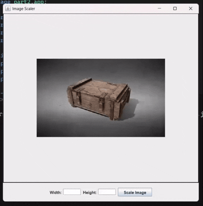

# Image Scaler Application - README

This project is a simple image scaling application built with Java Swing. The application allows the user to load an image and resize it based on the input width and height. The image is displayed in the top panel, while the controls are in the bottom panel.

## Project Structure

The project consists of the following Java classes:

1. **Launcher.java** - The entry point of the application.
2. **MainFrame.java** - The main window of the application that contains the other panels.
3. **ShowPanel.java** - The panel responsible for displaying the image.
4. **ControlPanel.java** - The panel responsible for user inputs to scale the image.

---

### 1. Launcher.java

The **Launcher** class is the entry point of the program. It initializes the `MainFrame` on the Event Dispatch Thread.

```java
package part2;

// Import necessary classes for Swing utilities and MainFrame
import javax.swing.SwingUtilities;
import part2.app.MainFrame;

public class Launcher {
    public static void main(String[] args) {
        // Launch the MainFrame on the Event Dispatch Thread
        SwingUtilities.invokeLater(() -> {
            new MainFrame(); // Create and show the main frame
        });
    }
}
```

---

### 2. MainFrame.java

This class defines the **Main Window** of the application. It sets up the layout, adds the `ShowPanel` and `ControlPanel`, and makes the window visible.

#### Class Definition and Constructor

```java
package part2.app;

import javax.swing.*;
import java.awt.*;

public class MainFrame extends JFrame {
    private ShowPanel showPanel;   // Panel for displaying the image
    private ControlPanel controlPanel; // Panel for controlling the image size

    public MainFrame() {
        setTitle("Image Scaler");
        setSize(600, 600); // Set window size
        setLocationRelativeTo(null); // Center the frame
        setDefaultCloseOperation(JFrame.EXIT_ON_CLOSE); // Close on exit
        setLayout(new BorderLayout()); // Use BorderLayout for panels

        // Initialize the panels
        showPanel = new ShowPanel();
        controlPanel = new ControlPanel(showPanel);

        // Add panels to the frame
        add(showPanel, BorderLayout.CENTER);  // Add the ShowPanel to the center
        add(controlPanel, BorderLayout.SOUTH); // Add the ControlPanel to the bottom

        setVisible(true); // Make the frame visible
    }
}
```


---

### 3. ShowPanel.java

This class defines the **ShowPanel**, which is responsible for displaying the image. It contains methods to load and scale the image. The image is centered in the panel.

#### Part 1: Class Definition and Constructor

```java
package part2.app;

import javax.swing.*;
import java.awt.*;
import java.io.*;
import javax.imageio.ImageIO;

public class ShowPanel extends JPanel {
    private Image image; // Image object to hold the loaded image
    private String imagePath = "./images/img.png"; // Path to the image file

    public ShowPanel() {
        setLayout(new BorderLayout()); // Set layout to BorderLayout
        setBorder(BorderFactory.createLineBorder(Color.BLACK, 2)); // Add border to the panel

        loadImage(); // Load the image initially
    }
}
```

#### Part 2: Loading the Image

```java
// Method to load the image from the specified path
public void loadImage() {
    try {
        // Load the image from the file system
        image = ImageIO.read(getClass().getResource(imagePath)); 
    } catch (IOException e) {
        e.printStackTrace(); // Print any error encountered during loading
    }
    repaint(); // Redraw the panel
}
```

#### Part 3: Scaling the Image

```java
// Method to scale the image to a specified width and height
public void scaleImage(int width, int height) {
    if (image != null) {
        Image scaledImage = image.getScaledInstance(width, height, Image.SCALE_SMOOTH); // Scale image
        image = scaledImage;
        repaint(); // Redraw the panel
    }
}
```

#### Part 4: PaintComponent to Center the Image

```java
// Override the paintComponent method to center the image on the panel
@Override
protected void paintComponent(Graphics g) {
    super.paintComponent(g); // Call the superclass method
    if (image != null) {
        // Calculate the x and y coordinates to center the image
        int x = (getWidth() - image.getWidth(null)) / 2;
        int y = (getHeight() - image.getHeight(null)) / 2;
        g.drawImage(image, x, y, this); // Draw the image at the calculated position
    }
}
```

---

### 4. ControlPanel.java

This class defines the **ControlPanel** responsible for user inputs. It allows the user to specify the desired width and height for the image and scale it. It also checks if the user input is valid and within the bounds of the panel size.

#### Part 1: Class Definition and Constructor

```java
package part2.app;

import javax.swing.*;
import java.awt.*;
import java.awt.event.ActionEvent;
import java.awt.event.ActionListener;

public class ControlPanel extends JPanel {
    private JTextField widthField, heightField; // Input fields for width and height
    private JButton scaleButton; // Button to trigger the scaling action
    private ShowPanel showPanel; // Reference to the ShowPanel

    public ControlPanel(ShowPanel showPanel) {
        this.showPanel = showPanel; // Set the reference to the ShowPanel
        setLayout(new FlowLayout()); // Use FlowLayout for arranging components
        setBackground(new Color(240, 240, 240)); // Set background color for the panel
        setBorder(BorderFactory.createEmptyBorder(10, 10, 10, 10)); // Add padding around the panel

        // Create text fields for width and height
        widthField = new JTextField(5);
        heightField = new JTextField(5);
        scaleButton = new JButton("Scale Image");
```
#### Part 2: Adding Components and ActionListener

```java
// Add components to the panel
add(new JLabel("Width:"));
add(widthField);
add(new JLabel("Height:"));
add(heightField);
add(scaleButton);

// Button action listener to scale the image
scaleButton.addActionListener(new ActionListener() {
    @Override
    public void actionPerformed(ActionEvent e) {
        try {
            int width = Integer.parseInt(widthField.getText()); // Get the entered width
            int height = Integer.parseInt(heightField.getText()); // Get the entered height

            // Get the dimensions of the ShowPanel
            int maxWidth = showPanel.getWidth();
            int maxHeight = showPanel.getHeight();

            // Check if the entered size is larger than the panel's size
            if (width > maxWidth || height > maxHeight) {
                JOptionPane.showMessageDialog(null, "Entered size cannot be larger than the panel size!");
            } else {
                // Reload the image and scale it
                showPanel.loadImage(); // Reload the image
                showPanel.scaleImage(width, height); // Scale the image
            }
        } catch (NumberFormatException ex) {
            JOptionPane.showMessageDialog(null, "Please enter valid numbers for width and height"); // Show error message
        }
    }
});
```

---

### How to Run the Application

1. **Open a terminal.**
2. **Change directory where Launcher.java is.**.
3. **Run this command:**
```bash
java Launcher.java
```

---

### Output of the code:



